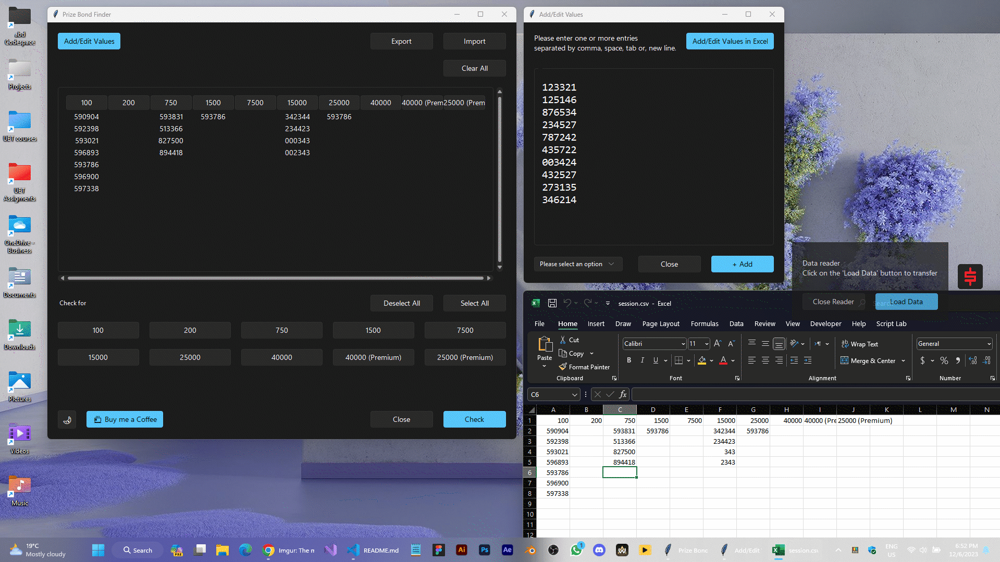

## Overview

The Prize Bond Finder Application is a user-friendly tool designed to streamline the management and tracking of prize bonds. With a beautiful GUI, seamless import/export options, and robust features, this application aims to enhance your experience in dealing with prize bonds.

## Features

- Import and Export Options
- User-Friendly GUI
- Excel Integration
- Multi-Selection Capability
- Session Restoration
- Works on Windows, Linux and Mac
- Beautiful Light and Dark Mode
- Excel Export

## Getting Started

1. Download the Prize Bond Finder Application from [here](https://github.com/abdxdev/PrizeBondFinder/releases/tag/Release).
2. Launch the application and start managing your prize bond data effortlessly.

## Feedback and Support

Enjoy the seamless experience of managing your prize bonds with the Prize Bond Finder Application!

